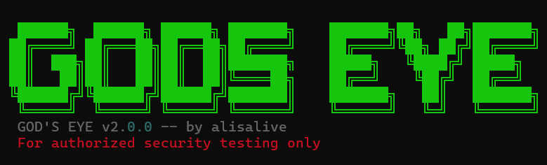

<div align="center">


# GOD'S EYE v2.0

**AI-powered web security scanner & fingerprinting tool**

[](https://python.org)
[](LICENSE)
[](https://github.com/alisalive/GOD-S-EYE)
[](https://github.com/alisalive/GOD-S-EYE)

*For authorized security testing only.*

</div>

---

## What is GOD'S EYE?

GOD'S EYE is a fast, accurate web security scanner built for penetration testers and security researchers. It goes beyond simple technology fingerprinting — it actively analyzes security posture, detects vulnerabilities, correlates CVEs, and generates professional HTML reports, all from a single command.

Think of it as **WhatWeb + Nikto + a security header analyzer**, combined into one tool with a clean output and zero noise.

```bash
godseye millisec.edu.az
godseye target.com --mode redteam
godseye target.com --ai --api-key sk-ant-...
```

---

## Features

### 🔍 Technology Fingerprinting (50+ detections)
Detects servers, CMS platforms, frameworks, frontend libraries, analytics, CDNs, and security tools — with version numbers where available.

| Category | Examples |
|---|---|
| Servers | Nginx, Apache, IIS, LiteSpeed |
| CMS | WordPress, Drupal, Joomla, Bitrix, Magento |
| Frameworks | Laravel, Django, Flask, Rails, Next.js, Express |
| Frontend | React, Vue, Angular, jQuery (with version), Bootstrap |
| Analytics | Google Analytics, GTM, Hotjar, Facebook Pixel |
| CDN/Hosting | Cloudflare, Vercel, Netlify, AWS CloudFront, Akamai |
| Security | reCAPTCHA, hCaptcha, Cloudflare Turnstile |

### 🛡️ Security Analysis
- **Missing security headers** — CSP, HSTS, X-Frame-Options, X-Content-Type-Options, Referrer-Policy, Permissions-Policy
- **Clickjacking detection** — flags when both X-Frame-Options and CSP frame-ancestors are absent
- **Outdated library detection** — compares detected versions against known CVEs (e.g. jQuery 2.x → CVE-2020-11022)
- **Cookie security** — checks HttpOnly, Secure, SameSite flags on session cookies
- **SSL/TLS analysis** — detects certificates expiring within 30 days

### 🔎 Endpoint Discovery
Checks 20 high-value paths concurrently with body verification to eliminate false positives:
`/.env`, `/.git/HEAD`, `/phpinfo.php`, `/adminer.php`, `/graphql`, `/swagger.json`, `/api/`, `/debug`, `/console`, and more.

### 📧 Email Harvesting
Extracts valid email addresses from page source, meta tags, and mailto links across multiple pages.

### 🚪 Port Scanning
Scans 18 ports including dangerous services. Automatically flags exposed database/cache ports:

| Port | Service | Severity |
|---|---|---|
| 6379 | Redis (unauthenticated) | CRITICAL |
| 27017 | MongoDB (unauthenticated) | CRITICAL |
| 9200 | Elasticsearch | CRITICAL |
| 8888 | Jupyter Notebook | CRITICAL |
| 3306 | MySQL | HIGH |
| 5432 | PostgreSQL | HIGH |
| 445 | SMB (ransomware risk) | HIGH |

### 🤖 AI Analysis (Optional)
Integrates with Claude AI to generate executive summaries, attack narratives, and remediation recommendations. Requires Anthropic API key.

### 📊 Professional Reports
Dark-mode HTML report with severity breakdown, CVE table, MITRE ATT&CK mapping, technology stack, and email findings. JSON export included.

---

## Installation

### Requirements
- Python 3.10+
- pip

### Windows

```cmd
git clone https://github.com/alisalive/GOD-S-EYE
cd GOD-S-EYE
setup.bat
```

### Kali Linux / Debian

```bash
git clone https://github.com/alisalive/GOD-S-EYE
cd GOD-S-EYE
chmod +x setup.sh && ./setup.sh
```

### Manual (any OS)

```bash
pip install -r requirements.txt
pip install -e .
```

---

## Usage

```bash
godseye <target> [OPTIONS]
```

The target can be passed directly without `--target`:

```bash
godseye example.com
godseye 192.168.1.1
godseye example.com --mode redteam --ai --api-key sk-ant-...
```

### All Flags

| Flag | Description |
|---|---|
| `target` | Target hostname or IP (positional) |
| `--target`, `-t` | Alternative target flag |
| `--mode`, `-m` | `pentest` (default) or `redteam` |
| `--ai` | Enable Claude AI analysis |
| `--api-key`, `-k` | Anthropic API key |
| `--output`, `-o` | Output directory (default: `./reports`) |
| `--stealth` | Enable stealth mode (delays + UA rotation) |
| `--interactive` | Pause between phases |
| `--subdomains` | Enable subdomain enumeration |
| `--screenshot` | Enable Playwright screenshots |
| `--dirbrute` | Enable directory brute-force |
| `--pdf` | Export report as PDF |
| `--config` | Path to custom YAML config |
| `--no-report` | Skip report generation |

### Examples

```bash
# Quick scan
godseye example.com

# Full pentest with AI
godseye example.com --mode pentest --ai --api-key sk-ant-...

# Red team engagement
godseye example.com --mode redteam --stealth --subdomains --screenshot --dirbrute

# With PDF export
godseye example.com --pdf

# Using environment variable for API key
export ANTHROPIC_API_KEY=sk-ant-...
godseye example.com --ai
```

---

## Scan Phases

| Phase | Name | Trigger |
|---|---|---|
| 1 | Reconnaissance (port scan + WAF detection) | always |
| 2 | Subdomain enumeration | `--subdomains` |
| 2.5 | Default credentials check | always |
| 3 | Web analysis (headers, cookies, emails, SQLi, XSS) | always |
| 3B | Technology fingerprinting (50+ detections) | always |
| 4 | CVE correlation + Metasploit mapping | always |
| 5 | Screenshots | `--screenshot` |
| 6 | AI analysis | `--ai` |
| 7 | Report generation (HTML + JSON) | always |

---

## Sample Output

```
◆ PHASE 3B — TECHNOLOGY FINGERPRINTING (50+ DETECTIONS)
  → Server: Nginx (high)
  → CMS: Bitrix (high)
  → Library: jQuery 2.2.4 (high)
  → Analytics: Google Analytics (high)
  ✓ Technologies: 8 detected

╭─────────────────── Engagement Summary ───────────────────╮
│ Target:  example.com                                     │
│ Duration: 0m 33s                                         │
│ CRITICAL .................... 0                          │
│ HIGH     #####............... 3                          │
│ MEDIUM   ######.............. 4                          │
│ LOW      #####............... 3                          │
│ INFO     ###................. 2                          │
│ Total: 12 findings                                       │
╰──────────────────────────────────────────────────────────╯

  HIGH   Missing security header: Content-Security-Policy
  HIGH   Missing security header: Strict-Transport-Security
  HIGH   Outdated library: jQuery 2.2.4 (CVE-2020-11022)
  MEDIUM Missing security header: X-Frame-Options
  MEDIUM Clickjacking protection missing
```

---

## Configuration

Edit `config/config.yaml` to customize scan behavior:

```yaml
scan:
  timeout: 2.0
  max_parallel_ports: 50

ai:
  model: "claude-sonnet-4-6"
  max_tokens: 2000

stealth:
  min_delay: 1.0
  max_delay: 3.0
  rotate_ua: true

paths:
  wordlists: "./config/wordlists"
  reports: "./reports"
```

---

## Performance

| Target Type | Scan Time |
|---|---|
| Simple site (2 ports) | ~30 seconds |
| CDN-protected site | ~60 seconds |
| Multi-port target | ~2 minutes |

---

## Disclaimer

GOD'S EYE is intended for **authorized security testing only**. Using this tool against systems you do not have explicit permission to test is illegal. The author assumes no liability for misuse.

See [DISCLAIMER.md](DISCLAIMER.md) for full terms.

---

## License

MIT License — see [LICENSE](LICENSE) for details.

---

<div align="center">

**Made by [alisalive](https://github.com/alisalive)**

</div>
